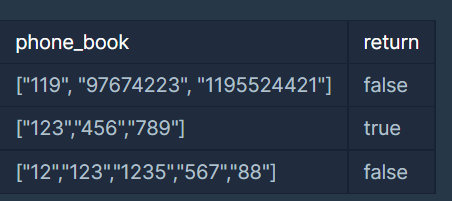

# 전화번호 목록
🔗문제 링크 : [전화번호 목록](https://school.programmers.co.kr/learn/courses/30/lessons/42577)

## 문제 설명
전화번호부에 적힌 전화번호 중, 한 번호가 다른 번호의 접두어인 경우가 있는지 확인하려 합니다.

전화번호가 다음과 같을 경우, 구조대 전화번호는 영석이의 전화번호의 접두사입니다.

- 구조대 : 119
- 박준영 : 97 674 223
- 지영석 : 11 9552 4421

전화번호부에 적힌 전화번호를 담은 배열 phone_book 이 solution 함수의 매개변수로 주어질 때, 어떤 번호가 다른 번호의 접두어인 경우가 있으면 false를 그렇지 않으면 true를 return 하도록 solution 함수를 작성해주세요.

## 제한 사항
- phone_book의 길이는 1 이상 1,000,000 이하입니다.

    - 각 전화번호의 길이는 1 이상 20 이하입니다.

    - 같은 전화번호가 중복해서 들어있지 않습니다.
## 입출력 예제

### 입출력 예 설명
#### 입출력 예 #1
앞에서 설명한 예와 같습니다.

#### 입출력 예 #2
한 번호가 다른 번호의 접두사인 경우가 없으므로, 답은 true입니다.

#### 입출력 예 #3
첫 번째 전화번호, “12”가 두 번째 전화번호 “123”의 접두사입니다. 따라서 답은 false입니다.

🔗참고 링크 : [개취님 블로그](https://coding-grandpa.tistory.com/m/entry/%ED%94%84%EB%A1%9C%EA%B7%B8%EB%9E%98%EB%A8%B8%EC%8A%A4-%EC%A0%84%ED%99%94%EB%B2%88%ED%98%B8-%EB%AA%A9%EB%A1%9D-%ED%95%B4%EC%8B%9C-Lv-2-%EC%9E%90%EB%B0%94-Java)